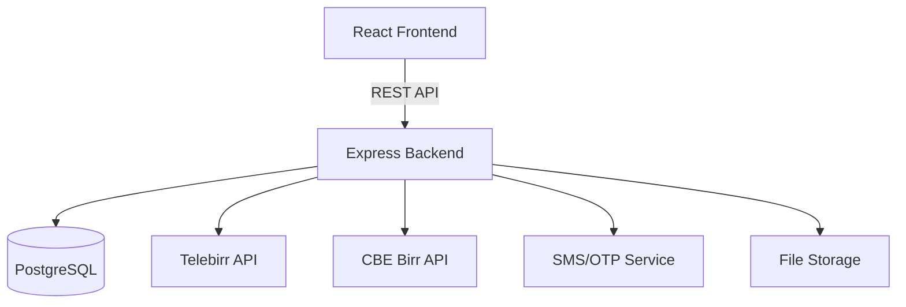

# Design Document: Ethiopian Marketplace

## Overview

The Ethiopian Marketplace is a full-stack B2B/B2C e-commerce platform tailored for Ethiopia. It supports Oromo and English languages, integrates Ethiopian payment gateways (Telebirr, CBE Birr, bank transfer), and provides a professional, interactive UI. The platform serves three user roles: Buyers, Sellers, and Admins.

---

## Architecture

The platform follows a monorepo structure with a clear separation between frontend, backend, and shared types.

```
ethiopian-marketplace/
├── frontend/          # React + Tailwind CSS SPA
├── backend/           # Node.js + Express REST API
├── shared/            # Shared TypeScript types and validation schemas
└── database/          # PostgreSQL migrations and seed data
```

### High-Level Architecture



---

## Components and Interfaces

### Frontend Components

- `AuthPage` - Login/Register with phone OTP or email/password
- `LanguageToggle` - Oromo/English switcher stored in session
- `ProductListingPage` - Paginated product grid with search and filters
- `ProductDetailPage` - Full product view with seller info and add-to-cart
- `CartPage` - Cart management with itemized totals in ETB
- `CheckoutPage` - Order summary and payment method selection
- `SellerDashboard` - Product listing management and order fulfillment
- `AdminDashboard` - User management, listing moderation, metrics

### Backend Modules

- `auth` - Registration, login, OTP generation/verification, JWT issuance
- `users` - User profile management (buyers and sellers)
- `products` - CRUD for product listings, search, filtering, pagination
- `orders` - Order creation, status management, notifications
- `payments` - Payment gateway integration (Telebirr, CBE Birr, bank transfer)
- `admin` - Admin-only routes for user/listing/order management
- `i18n` - Translation key management (Oromo/English)

### REST API Endpoints (key routes)

| Method | Path | Description |
|--------|------|-------------|
| POST | /api/auth/register | Register with email or phone |
| POST | /api/auth/login | Login with email/password or OTP |
| POST | /api/auth/otp/send | Send OTP to phone |
| POST | /api/auth/otp/verify | Verify OTP |
| GET | /api/products | Search and list products |
| POST | /api/products | Create product listing |
| PUT | /api/products/:id | Update product listing |
| DELETE | /api/products/:id | Deactivate/delete listing |
| POST | /api/orders | Place an order |
| GET | /api/orders/:id | Get order details |
| PUT | /api/orders/:id/status | Update order status |
| POST | /api/payments/telebirr | Initiate Telebirr payment |
| POST | /api/payments/cbe | Initiate CBE Birr payment |
| GET | /api/admin/dashboard | Admin metrics |

---

## Data Models

### User

```typescript
interface User {
  id: string;
  email?: string;
  phone?: string;
  passwordHash?: string;
  role: 'buyer' | 'seller' | 'admin';
  businessName?: string;       // sellers only
  businessCategory?: string;   // sellers only
  isActive: boolean;
  createdAt: Date;
  updatedAt: Date;
}
```

### Product

```typescript
interface Product {
  id: string;
  sellerId: string;
  title: string;
  description: string;
  priceETB: number;
  category: string;
  images: string[];            // file paths or URLs
  isActive: boolean;
  createdAt: Date;
  updatedAt: Date;
}
```

### Order

```typescript
interface Order {
  id: string;
  buyerId: string;
  sellerId: string;
  items: OrderItem[];
  totalETB: number;
  status: 'pending_payment' | 'paid' | 'shipped' | 'delivered' | 'cancelled';
  paymentMethod: 'telebirr' | 'cbe_birr' | 'bank_transfer';
  createdAt: Date;
  updatedAt: Date;
}

interface OrderItem {
  productId: string;
  quantity: number;
  unitPriceETB: number;
}
```

### Cart

```typescript
interface Cart {
  userId: string;
  items: CartItem[];
}

interface CartItem {
  productId: string;
  quantity: number;
}
```

### OTP

```typescript
interface OTPRecord {
  phone: string;
  code: string;
  expiresAt: Date;
  used: boolean;
}
```

---

## Correctness Properties

*A property is a characteristic or behavior that should hold true across all valid executions of a system-essentially, a formal statement about what the system should do. Properties serve as the bridge between human-readable specifications and machine-verifiable correctness guarantees.*


Property 1: OTP issuance on valid phone
*For any* valid phone number, calling the send-OTP function should result in an OTP record existing in the store for that phone number with a future expiry time.
**Validates: Requirements 1.1**

Property 2: Email registration produces valid token
*For any* valid email and password pair, completing registration should return a non-empty JWT session token that can be decoded to reveal the user's ID and role.
**Validates: Requirements 1.2**

Property 3: OTP round-trip authentication
*For any* phone number and matching OTP code submitted within the 5-minute expiry window, the verification function should return a valid session token.
**Validates: Requirements 1.3**

Property 4: Invalid OTP is rejected
*For any* OTP that is either expired or does not match the stored code, the verification function should return an error and not issue a session token.
**Validates: Requirements 1.4**

Property 5: Duplicate registration is rejected
*For any* already-registered email or phone number, a second registration attempt with the same credential should be rejected with a conflict error.
**Validates: Requirements 1.5**

Property 6: Product listing round-trip
*For any* valid product listing submitted by a seller, fetching that product by ID should return an object with all originally submitted field values preserved.
**Validates: Requirements 2.2, 2.3**

Property 7: Deactivated listing excluded from search
*For any* product listing that has been deactivated, a search query that would otherwise match that listing should not include it in the results.
**Validates: Requirements 2.4, 8.1**

Property 8: Invalid product listing is rejected
*For any* product submission missing one or more required fields (title, description, price, category, image), the system should return a validation error and not create a listing.
**Validates: Requirements 2.5**

Property 9: Search and filter results satisfy all criteria
*For any* combination of search query and filters (category, price range, location), every product returned should match the search query in at least one of title, description, or category, and satisfy every applied filter.
**Validates: Requirements 3.1, 3.2**

Property 10: Product detail contains all required fields
*For any* active product listing, the data returned by the product detail endpoint should include title, description, price in ETB, seller information, and at least one image URL.
**Validates: Requirements 3.3**

Property 11: Pagination limit enforced
*For any* page of search results, the number of items returned should be greater than zero and no greater than 24.
**Validates: Requirements 3.5**

Property 12: Cart add and remove consistency
*For any* cart and any product, adding a product then removing it should return the cart to its original state (idempotent round-trip).
**Validates: Requirements 4.1, 4.2**

Property 13: Order total arithmetic invariant
*For any* cart with one or more items, the computed order total should equal the sum of (unit price × quantity) for every item in the cart.
**Validates: Requirements 4.3**

Property 14: Order confirmation clears cart
*For any* non-empty cart, confirming an order should result in an order record existing in the system and the cart being empty.
**Validates: Requirements 4.4**

Property 15: Empty cart checkout is rejected
*For any* cart with zero items, attempting to initiate checkout should return an error and not create an order record.
**Validates: Requirements 4.5**

Property 16: Payment status transitions are valid
*For any* order, a successful payment confirmation should transition the order status from pending_payment to paid, and a failed payment should leave the order in pending_payment status.
**Validates: Requirements 5.1, 5.2, 5.4, 5.5**

Property 17: Language toggle returns translations for all keys
*For any* UI translation key and any supported language (Oromo or English), the i18n lookup function should return a non-empty string.
**Validates: Requirements 6.1, 6.2, 6.4**

Property 18: Language preference persistence
*For any* language selection, reading the stored language preference immediately after setting it should return the same language value.
**Validates: Requirements 6.3**

Property 19: Order status transition correctness
*For any* order, updating the status to a valid next state (e.g., paid → shipped → delivered) should persist the new status and record a timestamp.
**Validates: Requirements 7.2, 7.3**

Property 20: Serialization round-trip
*For any* valid data model object (User, Product, Order, Cart), serializing it to JSON and then deserializing it should produce an object with all field values equivalent to the original.
**Validates: Requirements 9.1, 9.2**

Property 21: Invalid JSON deserialization returns structured error
*For any* JSON string missing one or more required fields for a given model, deserialization should return a structured validation error and not produce a partial model object.
**Validates: Requirements 9.3**

---

## Error Handling

- All API endpoints return structured JSON errors: `{ error: string, code: string, details?: object }`
- Validation errors return HTTP 400 with field-level detail
- Authentication errors return HTTP 401
- Authorization errors return HTTP 403
- Not found errors return HTTP 404
- Payment gateway failures are logged and surfaced to the user with a retry option
- OTP expiry and mismatch return specific error codes so the frontend can display targeted messages

---

## Testing Strategy

### Unit Tests

Unit tests cover specific examples and edge cases:
- Auth: valid/invalid OTP, duplicate registration, token decoding
- Products: field validation, search matching logic
- Cart: add/remove operations, total calculation
- Orders: status transition validation
- i18n: key lookup for both languages
- Serialization: known good and bad JSON inputs

### Property-Based Testing

The property-based testing library used is **fast-check** (TypeScript/JavaScript).

Each property-based test:
- Runs a minimum of 100 iterations with randomly generated inputs
- Is tagged with a comment referencing the correctness property it implements
- Uses the exact format: `// Feature: ethiopian-marketplace, Property {N}: {property_text}`
- Covers one correctness property per test

Example test annotation:
```typescript
// Feature: ethiopian-marketplace, Property 20: Serialization round-trip
it('serialization round-trip holds for all Product objects', () => {
  fc.assert(
    fc.property(arbitraryProduct(), (product) => {
      expect(deserialize(serialize(product))).toEqual(product);
    }),
    { numRuns: 100 }
  );
});
```

Both unit tests and property-based tests are required. Unit tests catch concrete bugs in specific scenarios; property tests verify that general correctness holds across the full input space.
